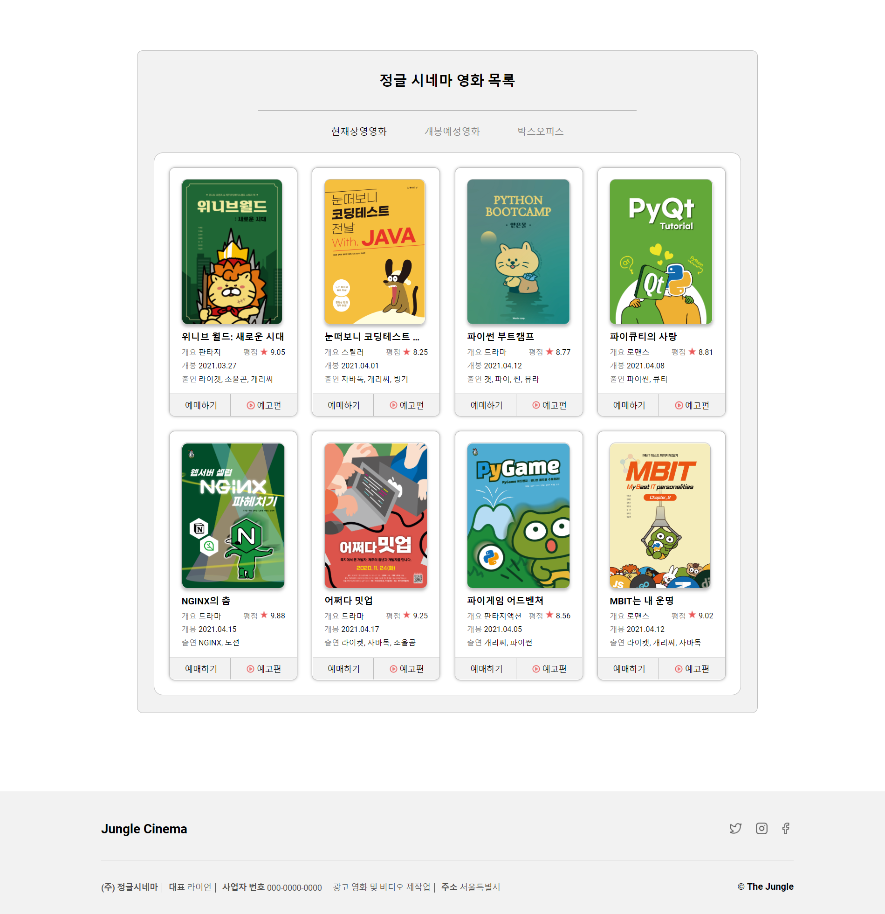
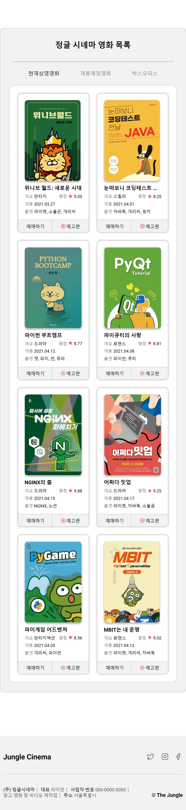
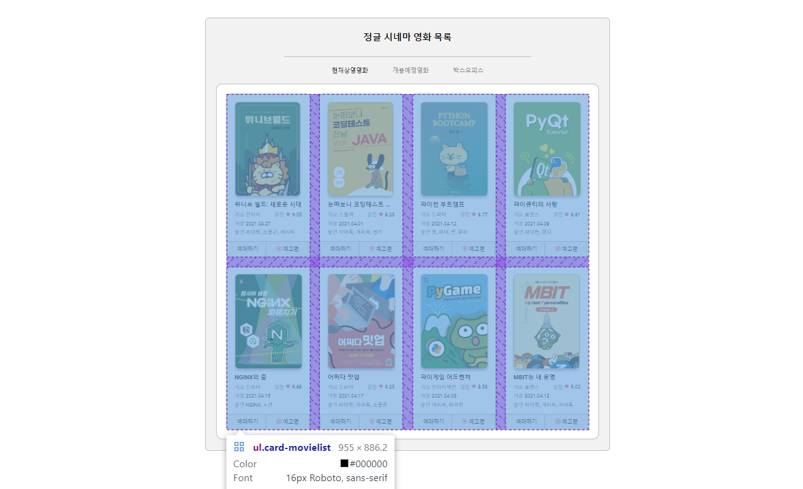
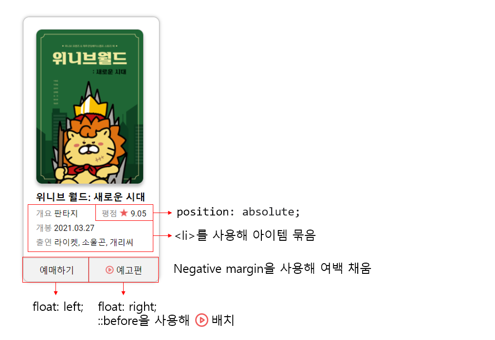
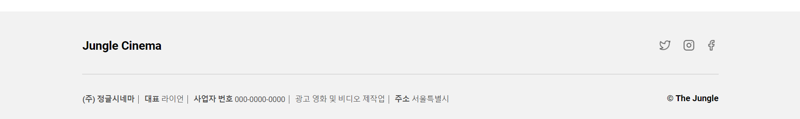
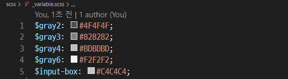

# 🎟 jungle-sinema
간단 설명: 정글 시네마 영화 목록 화면 구현하기

## 프로젝트 목표
1. Figma로 제시된 정글 시네마 페이지를 HTML, SASS를 사용하여 구현합니다.
2. 반응형 화면을 구현하여 PC와 Moblie 화면을 구현합니다.

## 사용언어
 

## 결과 화면
 링크: https://minkyeongj.github.io/jungle-sinema/

 - <strong>PC화면</strong>
 

 - <strong>Moblie 화면</strong>

    

## 구현과정

- JS를 이용한 색변경을 위해 별도의 class를 이용해 CSS 변경

- &lt;li>를 사용해 아이템을 묶고 Grid를 이용해 아이템 배치

- card 구현

- 이미지 스프라이트를 이용하여 아이콘 배치

- SASS의 기능을 활용하여 색을 변수로 선언하여 사용

## 만들면서 배운 점

1. min-width의 활용
2. footer의 구성
3. nagative margin의 활용

## 만들면서 생긴 고민

1. 반응형 화면의 footer의 구성을 어떻게 해야 깨지지 않게 만들까?
2. 개발자 도구로 확인한 Moblie 버전의 화면과 실제 스마트폰으로 확인한 Moblie 화면이 다른 이유는 무엇일까?
3. card의 예매하기, 예고편 버튼 구성 시 더 좋은 방법이 없을까?
4. 중복된 코드와 중복되지 않은 코드의 기준은 어디까지일까?

## 소감
SASS의 편리성을 체감하는 작업이었습니다. CSS로 작성하는 것 보다 코드의 라인 수도 짧아졌고, 보기도 훨씬 좋아 유지보수가 쉬울 것이라 생각이 들었습니다. 변수를 활용하여 color를 선언하는 것에 편리함과 간편함을 느꼈습니다.